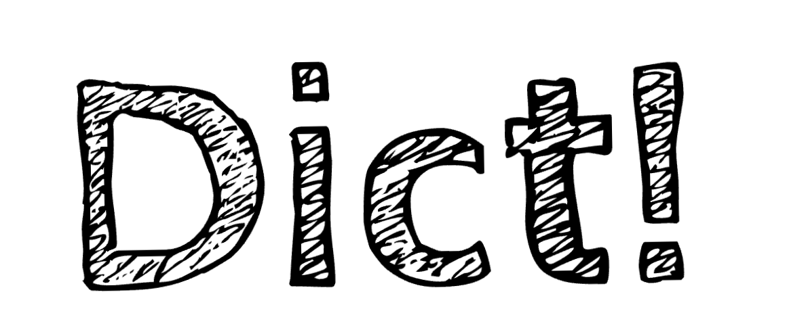

**Dict!** is a multiplayer word-building game where quick thinking and vocabulary skills determine the winner. Players take turns adding letters to an evolving word, aiming to form valid words while avoiding dead ends. The game dynamically checks words against a dictionary and awards or deducts points based on successful or failed word completions. Strategy and linguistic intuition are key—anticipate possible words while setting traps for your opponent!

<h3 align="center"><a href="https://dict-game.netlify.app/">play Dict!</a></h5>
